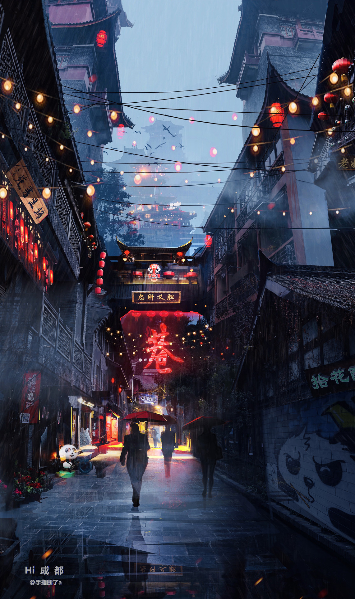

# Table of Contents

1.  [Cyberpunk](#org6d311b3)
    1.  [ArtStation - Cyberpunk Busy Street , Donglu Yu](#orge116d66)
    2.  [ArtStation - Barcelona Smoke & Neons: Sant Pau i La Sagrada Familia, Guillem H. Pongiluppi](#org12b8a77)
    3.  [ArtStation - Cyberpunk Alley Environment, James Atkinson](#orgf647103):city:modern:
2.  [City](#org2337011)
    1.  [theartofmany: Artist: 手指断了 a Title: Hi ChengDu &#x2026; - Our Sci-Fi Future](#org277838e)
3.  [Science Fiction](#org6be2ca5)
    1.  [ArtStation - xcom , Eddie Del Rio](#org2981fb2)
4.  [Environments](#org7260967)
    1.  [ArtStation - Subterra, Wadim Kashin](#org457c838)
    2.  [ArtStation - Barcelona Aftermath: El Palau de la Música, Guillem H. Pongiluppi](#org3493c35):Concept:
5.  [Fantasy](#org3d60736)
    1.  [ArtStation - The Mountain Kingdom, Max Bedulenko](#orgbf917b8):mountain:Environments:

# Cyberpunk

## [ArtStation - Cyberpunk Busy Street , Donglu Yu](https://www.artstation.com/artwork/KqZ1y)

## ❤ Love [ArtStation - Barcelona Smoke & Neons: Sant Pau i La Sagrada Familia, Guillem H. Pongiluppi](https://www.artstation.com/artwork/Xag90)

## [ArtStation - Cyberpunk Alley Environment, James Atkinson](https://www.artstation.com/artwork/Z5gJ5N)     :city:modern:

# City

## [theartofmany: Artist: 手指断了 a Title: Hi ChengDu &#x2026; - Our Sci-Fi Future](https://the-binary-tomorrow.tumblr.com/post/173454677836/theartofmany-artist-%E6%89%8B%E6%8C%87%E6%96%AD%E4%BA%86-a-title-hi-chengdu)

# Science Fiction

## [ArtStation - xcom , Eddie Del Rio](https://www.artstation.com/artwork/NKYRD)

# Environments

## [ArtStation - Subterra, Wadim Kashin](https://www.artstation.com/artwork/xdR3O)

## [ArtStation - Barcelona Aftermath: El Palau de la Música, Guillem H. Pongiluppi](https://www.artstation.com/artwork/3ENAg)     :Concept:

# Fantasy

## [ArtStation - The Mountain Kingdom, Max Bedulenko](https://www.artstation.com/artwork/L4n65)     :mountain:Environments:

