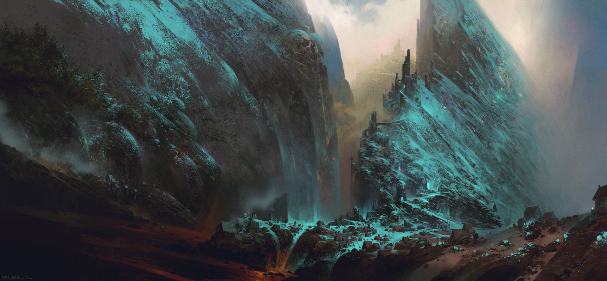

# Table of Contents

1.  [Cyberpunk](#org1c01bc4)
    1.  [ArtStation - Cyberpunk Busy Street , Donglu Yu](#orgcb188fe)
    2.  [ArtStation - Barcelona Smoke & Neons: Sant Pau i La Sagrada Familia, Guillem H. Pongiluppi](#org76acda9)
2.  [Science Fiction](#org4ee3112)
    1.  [ArtStation - xcom , Eddie Del Rio](#org1337884)
3.  [Environments](#org54c6408)
    1.  [ArtStation - Subterra, Wadim Kashin](#orgac8e717)
4.  [Fantasy](#orgbb811d4)
    1.  [ArtStation - The Mountain Kingdom, Max Bedulenko](#org4279a7b):mountain:Environments:

# Cyberpunk

## [ArtStation - Cyberpunk Busy Street , Donglu Yu](https://www.artstation.com/artwork/KqZ1y)

## ❤ Love [ArtStation - Barcelona Smoke & Neons: Sant Pau i La Sagrada Familia, Guillem H. Pongiluppi](https://www.artstation.com/artwork/Xag90)

# Science Fiction

## [ArtStation - xcom , Eddie Del Rio](https://www.artstation.com/artwork/NKYRD)

# Environments

## [ArtStation - Subterra, Wadim Kashin](https://www.artstation.com/artwork/xdR3O)

# Fantasy

## [ArtStation - The Mountain Kingdom, Max Bedulenko](https://www.artstation.com/artwork/L4n65)     :mountain:Environments:

