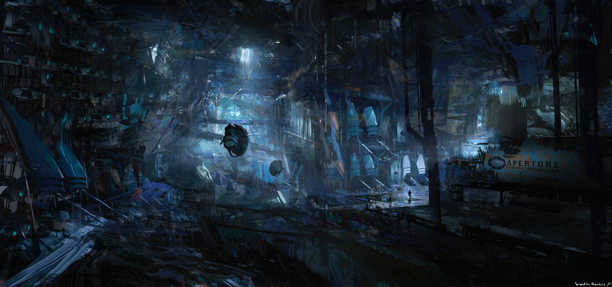
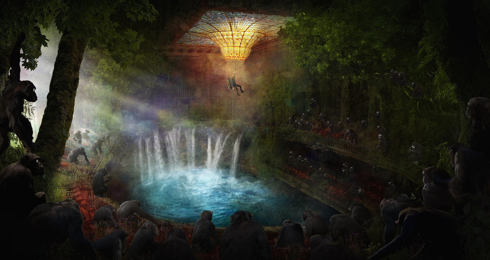

# Table of Contents

1.  [Cyberpunk](#org0b3f519)
    1.  [ArtStation - Cyberpunk Busy Street , Donglu Yu](#orgeb8bc24)
    2.  [ArtStation - Barcelona Smoke & Neons: Sant Pau i La Sagrada Familia, Guillem H. Pongiluppi](#org323795d)
    3.  [ArtStation - Cyberpunk Alley Environment, James Atkinson](#orgeb97051):city:modern:
2.  [City](#orgc161b2c)
    1.  [theartofmany: Artist: 手指断了 a Title: Hi ChengDu &#x2026; - Our Sci-Fi Future](#org120275e)
    2.  [ArtStation - Half-Life - (February work), Wadim Kashin](#org1476fe1)
3.  [Science Fiction](#orgcd11d63)
    1.  [ArtStation - xcom , Eddie Del Rio](#orgbb66318)
4.  [Environments](#orgc17b5ac)
    1.  [ArtStation - Subterra, Wadim Kashin](#org4788a49)
    2.  [ArtStation - Barcelona Aftermath: El Palau de la Música, Guillem H. Pongiluppi](#org0918675):Concept:
    3.  [ArtStation - Environment concepts , Grafit Studio](#org4d5893f)
    4.  [ArtStation - Rift Nightmare Tide environment concept, Herman Ng](#orgac58451)
5.  [Fantasy](#orgf737425)
    1.  [ArtStation - The Mountain Kingdom, Max Bedulenko](#orga30a611):mountain:Environments:
6.  [Sky & sea](#orgec82003)
    1.  [ArtStation - More animation environments, Ned Rogers](#orgf9564f2)

# Cyberpunk

## [ArtStation - Cyberpunk Busy Street , Donglu Yu](https://www.artstation.com/artwork/KqZ1y)

## ❤ Love [ArtStation - Barcelona Smoke & Neons: Sant Pau i La Sagrada Familia, Guillem H. Pongiluppi](https://www.artstation.com/artwork/Xag90)

## [ArtStation - Cyberpunk Alley Environment, James Atkinson](https://www.artstation.com/artwork/Z5gJ5N)     :city:modern:

# City

## [theartofmany: Artist: 手指断了 a Title: Hi ChengDu &#x2026; - Our Sci-Fi Future](https://the-binary-tomorrow.tumblr.com/post/173454677836/theartofmany-artist-%E6%89%8B%E6%8C%87%E6%96%AD%E4%BA%86-a-title-hi-chengdu)

## [ArtStation - Half-Life - (February work), Wadim Kashin](https://www.artstation.com/artwork/EaaRn)

# Science Fiction

## [ArtStation - xcom , Eddie Del Rio](https://www.artstation.com/artwork/NKYRD)

# Environments

## [ArtStation - Subterra, Wadim Kashin](https://www.artstation.com/artwork/xdR3O)

## [ArtStation - Barcelona Aftermath: El Palau de la Música, Guillem H. Pongiluppi](https://www.artstation.com/artwork/3ENAg)     :Concept:

## [ArtStation - Environment concepts , Grafit Studio](https://www.artstation.com/artwork/vwAn3)

1.  Next

    

## [ArtStation - Rift Nightmare Tide environment concept, Herman Ng](https://www.artstation.com/artwork/0ZrWV)

# Fantasy

## [ArtStation - The Mountain Kingdom, Max Bedulenko](https://www.artstation.com/artwork/L4n65)     :mountain:Environments:

# Sky & sea

## [ArtStation - More animation environments, Ned Rogers](https://www.artstation.com/artwork/aRB4kX)

